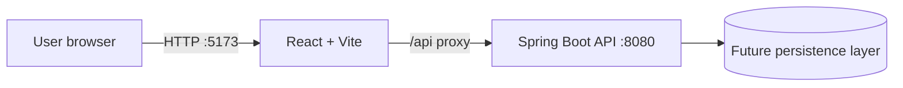

# Architecture

## Overview

TRUpload is organized as two independently runnable applications:

The frontend owns presentation and client-side interaction. The backend owns API contracts, validation, business rules, and persistence integrations. The browser should communicate with the backend through `/api` endpoints rather than hard-coding environment-specific hostnames.

## Repository layout

- `frontend/src/`: React components, styles, and client-side services.
- `backend/src/main/java/`: Spring Boot application and REST endpoints.
- `backend/src/main/resources/`: application configuration and runtime resources.
- `docs/`: architecture decisions and development notes.

## Local development

Vite proxies `/api` to `http://localhost:8080` during development. This keeps frontend requests identical between local development and a reverse-proxy deployment. Spring Boot exposes the API on port `8080` and allows the Vite origin for direct local access.

## Suggested growth path

1. Define versioned endpoints under `/api/v1` once the domain is established.
2. Add feature packages in the backend with controller, service, and repository boundaries.
3. Add a persistence module and database migrations when data requirements are known.
4. Add frontend route-level features and a typed API client as the number of endpoints grows.
5. Add unit, integration, and end-to-end tests around the highest-value workflows.

## Conventions

- Keep API responses and errors stable and documented.
- Put business logic in backend services, not controllers.
- Keep reusable UI components small and feature-focused.
- Store secrets in environment variables; never commit them.
